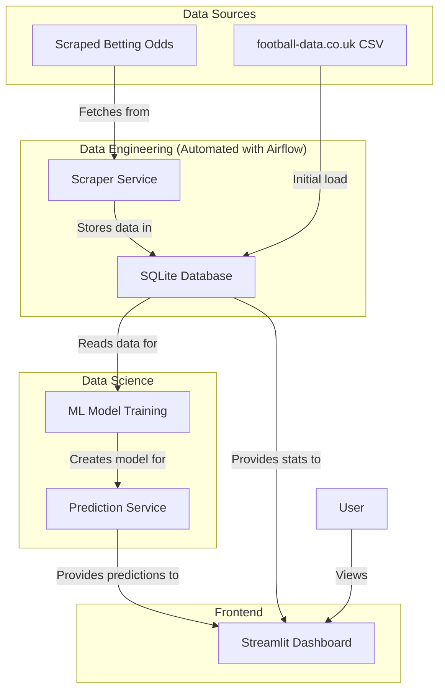

# Architecture: Football Match Prediction MVP

## 1. Overview

This document outlines the architecture for the Minimum Viable Product (MVP) of the Football Match Prediction system. The design prioritizes simplicity, clear separation of concerns, and the use of a lightweight, Python-based stack to meet the project's core requirements.

The system is composed of three main components:
1.  **Data Engineering Pipeline**: Responsible for collecting and storing data.
2.  **Data Science Pipeline**: Responsible for training and serving the prediction model.
3.  **Frontend Application**: Responsible for displaying the predictions and data to the user.

## 2. System Architecture Diagram

## 3. Component Breakdown

### 3.1. Data Engineering

-   **Scraper Service (Python)**:
    -   A Python script using libraries like `Playwright` (for dynamic content), `requests` and `BeautifulSoup` (for static content) to scrape betting odds from the specified websites.
    -   This service will be triggered by Airflow.
-   **Database (SQLite)**:
    -   A simple, file-based SQLite database will be used to store the historical match data from the provided CSV and the scraped odds.
    -   This is sufficient for the MVP and requires no external services.
-   **Orchestration (Airflow)**:
    -   Airflow will be used to schedule and automate two main tasks:
        1.  Periodically run the scraper service to get the latest odds.
        2.  Periodically trigger the model retraining process.

### 3.2. Data Science

-   **ML Model (Python)**:
    -   A machine learning model will be developed using libraries like `scikit-learn` or `XGBoost`.
    -   The model will be trained on the historical data and scraped odds to predict match outcomes (Home Win, Draw, Away Win).
-   **Prediction Service (Python)**:
    -   A simple Python function or class that loads the trained model and provides an interface to get predictions for upcoming matches.

### 3.3. Frontend

-   **Streamlit Dashboard (Python)**:
    -   A web-based dashboard built with Streamlit to display:
        -   The next 3 upcoming matches.
        -   The model's prediction for each match.
        -   The scraped betting odds for each match.
        -   Key statistics for the teams involved in the upcoming matches.

## 4. Data Flow

1.  **Initial Setup**: The historical data from the CSV is loaded into the SQLite database.
2.  **Data Collection**: Airflow triggers the scraper to fetch new betting odds, which are then stored in the database.
3.  **Model Training**: Airflow triggers the model training script, which reads the combined data from the database and saves the trained model as a file (e.g., a `.pkl` file).
4.  **Prediction and Display**:
    -   The Streamlit app starts.
    -   It calls the prediction service to get predictions for the upcoming matches.
    -   It queries the database directly to get team statistics.
    -   It displays all this information to the user.

## 5. Technology Stack

-   **Language**: Python
-   **Frontend**: Streamlit
-   **Data Storage**: SQLite
-   **Data Scraping**: Playwright, BeautifulSoup, Requests
-   **ML/Data Science**: Pandas, Scikit-learn (or similar)
-   **Orchestration**: Apache Airflow

This architecture is designed to be simple to implement for the MVP, while also being modular enough to allow for future evolution, such as replacing SQLite with a more robust database or deploying the prediction service as a separate API.