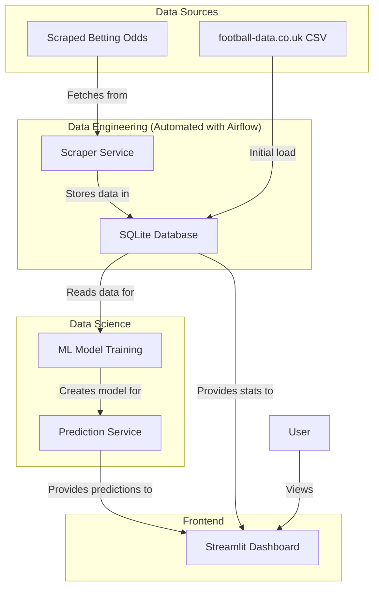

# 2. System Architecture Diagram

```mermaid
graph TD
    subgraph "Data Sources"
        A[football-data.co.uk CSV]
        B[Scraped Betting Odds]
    end

    subgraph "Data Engineering (Automated with Airflow)"
        C[Scraper Service]
        D[SQLite Database]
        C -- Stores data in --> D
        A -- Initial load --> D
        B -- Fetches from --> C
    end

    subgraph "Data Science"
        E[ML Model Training]
        F[Prediction Service]
        D -- Reads data for --> E
        E -- Creates model for --> F
    end

    subgraph "Frontend"
        G[Streamlit Dashboard]
        F -- Provides predictions to --> G
        D -- Provides stats to --> G
    end

    U[User] -- Views --> G
```
