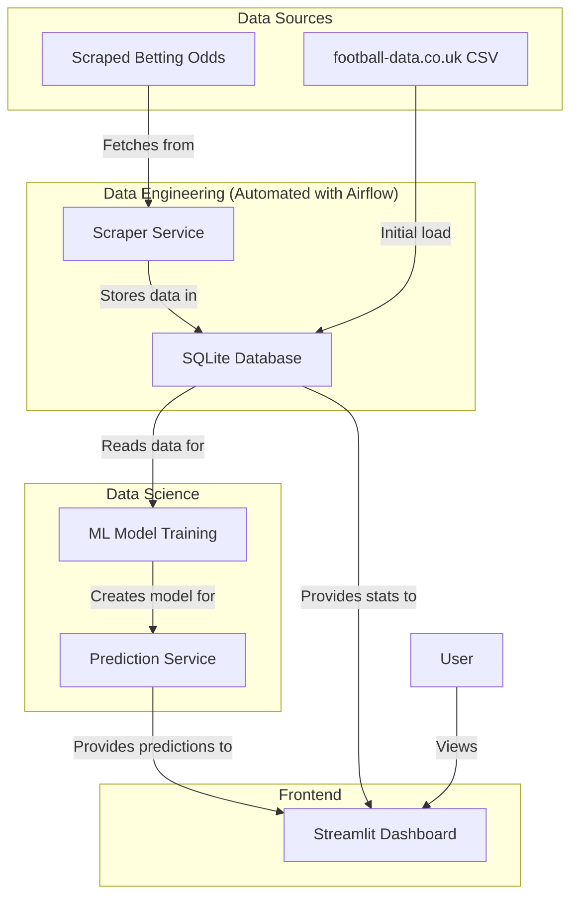

# Football Match Prediction Project Data Architecture Document

## 1. Introduction

This document outlines the overall project architecture for Football Match Prediction Project, including backend systems, shared services, and non-UI specific concerns. Its primary goal is to serve as the guiding architectural blueprint for AI-driven development, ensuring consistency and adherence to chosen patterns and technologies.

**Relationship to Frontend Architecture:**
If the project includes a significant user interface, a separate Frontend Architecture Document will detail the frontend-specific design and MUST be used in conjunction with this document. Core technology stack choices documented herein (see "Tech Stack") are definitive for the entire project, including any frontend components.

### Starter Template or Existing Project

This is a greenfield project. No specific starter template is being used, but the project will be developed within a single GitHub repository (`football-prediction`) as a Python-based monolith.

### Change Log

| Date | Version | Description | Author |
|---|---|---|---|
| 2025-07-27 | 1.0 | Initial Draft based on PRD and Frontend Spec | Architect |

## 2. High Level Architecture

### Technical Summary

This system's overall architecture is a Python-based monolith, designed to predict football match outcomes. It comprises a data engineering pipeline for data collection and storage, a data science pipeline for model training and prediction, and a Streamlit-based frontend for displaying results. The architecture prioritizes simplicity and clear separation of concerns to support the MVP goals of data-driven insights and interactive visualization.

### High Level Overview

1.  **Main Architectural Style:** Monolith (Python-based)
2.  **Repository Structure:** Monorepo (`football-prediction`)
3.  **Service Architecture:** Clear separation of concerns between data engineering (scraping, database, Airflow) and data analysis (ML model, Streamlit app) components, residing within the same codebase.
4.  **Primary Data Flow:** Data flows from external sources (CSV, scraped websites) into an SQLite database, then to the ML model for training and prediction, and finally displayed on the Streamlit dashboard.
5.  **Key Architectural Decisions:** Use of SQLite for simplicity in MVP, Python for unified language, and Airflow for orchestration.

### High Level Project Diagram

### Architectural and Design Patterns

-   **Monolithic Architecture:** For simplicity and ease of deployment in the MVP. _Rationale:_ Aligns with the project's initial scope and resource constraints.
-   **Repository Pattern:** To abstract data access logic. _Rationale:_ Enables easier testing and potential future migration to different database systems without significant code changes.
-   **Data Pipeline Pattern:** For structured data ingestion, processing, and delivery. _Rationale:_ Ensures data quality, consistency, and automates the flow from source to consumption.

## 3. Tech Stack

This is the DEFINITIVE technology selection section. I will work with you to make specific choices. Please review the following and provide your input. If you are unsure about any, I can provide suggestions with rationale.

### Cloud Infrastructure

-   **Provider:** TBD (Free hosting services preferred for database)
-   **Key Services:** TBD
-   **Deployment Regions:** TBD

### Technology Stack Table

| Category | Technology | Version | Purpose | Rationale |
|---|---|---|---|---|
| **Language** | Python | TBD | Primary development language | Unified language across all components (frontend, backend, data processing, ML) |
| **Frontend Framework** | Streamlit | TBD | Interactive dashboard | Rapid development of web-based dashboards with Python |
| **Database** | SQLite | TBD | Local development data storage | Simple, file-based, sufficient for MVP. Consideration for free hosting services for deployment. |
| **Data Scraping** | Playwright | TBD | Web scraping (dynamic content) | Handles JavaScript-rendered content and anti-bot measures effectively |
| **Data Scraping** | BeautifulSoup | TBD | Web scraping (static content) | Efficient for parsing static HTML content |
| **Data Scraping** | Requests | TBD | Web scraping (HTTP requests) | Standard library for making HTTP requests |
| **ML/Data Science** | Pandas | TBD | Data manipulation and analysis | Powerful and flexible for data handling |
| **ML/Data Science** | Scikit-learn (or similar, e.g., XGBoost) | TBD | Machine Learning model development | Standard library for various ML algorithms |
| **Orchestration** | Apache Airflow | TBD | Automating data pipelines | Scheduling and monitoring of data scraping and model retraining tasks |

## 4. Data Models

Define the core data models/entities. I will work with you to identify key business entities from the PRD requirements.

## 5. Components

Identify major logical components/services and their responsibilities based on the architectural patterns, tech stack, and data models.

## 6. External APIs

Identify and document any external API integrations required for the project.

## 7. Core Workflows

Illustrate key system workflows using sequence diagrams.

## 8. REST API Spec

If the project includes a REST API, create an OpenAPI 3.0 specification.

## 9. Database Schema

Transform the conceptual data models into concrete database schemas.

## 10. Source Tree

Create a project folder structure that reflects the chosen architecture.

## 11. Infrastructure and Deployment

Define the deployment architecture and practices.

## 12. Error Handling Strategy

Define a comprehensive error handling approach.

## 13. Coding Standards

Define MANDATORY coding standards for AI and human developers.

## 14. Test Strategy and Standards

Define a comprehensive test strategy.

## 15. Security

Define MANDATORY security requirements for AI and human developers.

## 16. Checklist Results Report

## 17. Next Steps

