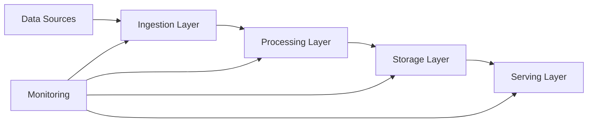

# Data Pipeline Architecture: Football Match Prediction Project

## Executive Summary
This document outlines the data pipeline architecture for the Football Match Prediction Project. The system is designed to predict Belgian Jupiler Pro League football match outcomes by integrating historical data with real-time scraped information (odds, recent matches). It leverages a Python-based monolith architecture with clear separation of concerns for data engineering, data science, and a Streamlit-based frontend. The pipeline will automate data ingestion, model training, and prediction serving to provide data-driven insights to users.

## Business Requirements

### Objectives
- Predict Belgian Jupiler Pro League football match outcomes.
- Combine historical data with real-time scraped information (odds, recent matches).
- Present predictions via a Streamlit dashboard.
- Provide users with data-driven insights and a visual representation of predictions and team statistics.
- Offer an end-to-end solution for football match prediction, from data ingestion and model training to interactive visualization.
- Enable users to make informed decisions or simply enjoy data-driven insights into football matches.

### Success Metrics
- Achieve a predictive accuracy rate of X% for match outcomes (to be defined during model training and evaluation).
- Ensure the Streamlit dashboard is accessible and functional for users.
- Successfully automate data scraping and model retraining processes with Airflow.
- User engagement with the Streamlit dashboard (e.g., number of unique visitors, session duration).
- Positive feedback on the clarity and usefulness of predictions and statistics.
- Prediction Accuracy: Percentage of correctly predicted match outcomes.
- Data Freshness: Frequency and success rate of data updates via Airflow.
- Dashboard Uptime: Availability of the Streamlit application.

### Constraints
- Budget: Free hosting services preferred for the database.
- Timeline: 8 days duration, deadline 13/09/2024 5PM.
- Resources: Team of 4 learners.
- Technical: Reliance on provided historical dataset and specified scraping sources.

## Data Sources

### Source Systems
#### football-data.co.uk CSV
- **Type**: File
- **Format**: CSV
- **Volume**: Historical data (initial load)
- **Frequency**: One-time initial load
- **Schema**: Date, Time, HomeTeam, AwayTeam, FTHG, FTAG, FTR, and additional statistics/odds (as per notes.txt)
- **Access Method**: Local file system
#### Scraped Betting Odds
- **Type**: Web
- **Format**: HTML (parsed to structured data)
- **Volume**: Ongoing, real-time updates
- **Frequency**: Periodically (e.g., daily or hourly) via Airflow
- **Schema**: MatchID, Bookmaker, HomeOdds, DrawOdds, AwayOdds (to be defined precisely)
- **Access Method**: HTTP requests via Playwright/Requests/BeautifulSoup

## Architecture Overview

### High-Level Architecture

### Architecture Pattern
**Selected Pattern**: Data Pipeline Pattern

**Rationale**: Ensures structured data ingestion, processing, and delivery, promoting data quality, consistency, and automation from source to consumption.

## System Components

### Ingestion Layer
- **Technology**: Python scripts (using Playwright, Requests, BeautifulSoup), Apache Airflow
- **Capacity**: Designed for the volume of historical CSV data and periodic updates from betting sites.
- **Scalability**: Initial design for MVP, can be scaled by optimizing scraping frequency and parallelization if needed.
- **Error Handling**: Basic error handling for network issues and website structure changes in scraper. Airflow for task retry and logging.

### Processing Layer
- **Technology**: Python (Pandas, Scikit-learn/XGBoost)
- **Processing Type**: Batch processing for historical data and model retraining; near real-time for scraped odds.
- **Transformation Logic**: Data cleaning, feature selection, handling categorical variables, data aggregation for team statistics.
- **Data Quality**: Validation of scraped data structure, consistency checks with historical data.

### Storage Layer
- **Primary Storage**: SQLite (`football.db`)
- **Backup Strategy**: Manual backups for MVP. Future consideration for automated backups.
- **Retention Policy**: All historical and scraped data will be retained for model training and analysis.
- **Partitioning Strategy**: Not applicable for SQLite MVP. Future consideration for larger databases.

### Serving Layer
- **API Technology**: Python functions/classes (for ML model predictions), Streamlit (for dashboard display)
- **Caching Strategy**: Not explicitly defined for MVP. Streamlit's caching mechanisms can be leveraged.
- **Load Balancing**: Not applicable for single Streamlit instance MVP.
- **Rate Limiting**: Not applicable for internal serving layer.

## Data Flow

### Processing Steps
#### Step 0: Initial Historical Data Ingestion
- **Input**: `historical_data.csv`
- **Processing**: Read CSV, load into Pandas DataFrame, infer schema, load into `matches` table in `football.db`.
- **Output**: Populated `matches` table in `football.db`.
- **Error Handling**: Script should be idempotent, handle file not found.
#### Step 1: Periodic Betting Odds Scraping
- **Input**: Target betting odds websites URLs.
- **Processing**: Launch Playwright browser, navigate to URLs, extract odds data using locators, structure data.
- **Output**: New/updated odds data in `football.db` (new table or updated match records).
- **Error Handling**: `try-except` for network issues, website structure changes. Airflow for task failure.
#### Step 2: ML Model Training
- **Input**: `matches` table from `football.db` (historical and recent data).
- **Processing**: Read data, preprocess (feature selection, handling categorical variables), train ML model (e.g., RandomForestClassifier) to predict `FTR`.
- **Output**: Trained model saved as `prediction_model.pkl`.
- **Error Handling**: Log model training errors, ensure model persistence.
#### Step 3: Prediction Serving
- **Input**: New match data (features of upcoming matches).
- **Processing**: Load `prediction_model.pkl`, use `predict_outcome()` function to generate predictions.
- **Output**: Predicted outcomes (H, D, or A).
- **Error Handling**: Handle missing model file, invalid input data.
#### Step 4: Streamlit Dashboard Display
- **Input**: Predictions from ML model, team statistics from `football.db`, odds from `football.db`.
- **Processing**: Query `football.db` for upcoming matches, team stats, and odds. Call prediction service. Render data on Streamlit UI.
- **Output**: Interactive web dashboard.
- **Error Handling**: Graceful handling for missing data, display messages for no upcoming matches.

### Data Lineage
Data originates from `football-data.co.uk` CSV and various betting websites. It is ingested into the SQLite `football.db` database. This data is then used by Python scripts for ML model training and prediction. Finally, the predictions and raw data are consumed by the Streamlit dashboard for display to the user. Airflow orchestrates the scraping and model retraining processes.

## Infrastructure

### Cloud Platform
**Platform**: TBD (Free hosting services preferred for database)

### Resource Requirements
- **Compute**: Moderate for Python scripts and Streamlit app. Airflow requires a dedicated environment.
- **Storage**: Minimal for SQLite database and model files.
- **Network**: Standard internet access for web scraping.
- **Estimated Cost**: Aim for minimal cost, leveraging free tiers where possible.

### Infrastructure as Code
- **Tool**: TBD (Not explicitly defined for MVP, manual setup likely)
- **Repository**: `football-prediction` (main GitHub repository)
- **Deployment Strategy**: Manual deployment for MVP. Future consideration for automated CI/CD.

## Security & Compliance

### Data Security
- **Encryption at Rest**: Not applicable for SQLite MVP (file-based). Future consideration for cloud databases.
- **Encryption in Transit**: Not explicitly defined for MVP. Standard HTTPS for web scraping.
- **Access Controls**: File system permissions for SQLite. No sensitive user data involved.
- **Audit Logging**: Basic logging within Python scripts and Airflow logs.

### Compliance Requirements
No specific compliance requirements beyond basic data security for the MVP.

## Monitoring & Observability

### Metrics
- **Performance Metrics**: Script execution times, data ingestion rates, model training duration.
- **Business Metrics**: Prediction accuracy, dashboard uptime.
- **Error Metrics**: Scraper failures, database connection errors, model prediction errors.

### Alerting
- **Alert Channels**: TBD (e.g., Airflow alerts, basic console logging)
- **Escalation Policy**: TBD
- **SLA Targets**: TBD

### Logging
- **Log Aggregation**: Basic file logging for scripts, Airflow logs.
- **Log Retention**: TBD
- **Log Analysis**: Manual review of logs.

## Disaster Recovery

### Backup Strategy
Manual backup of `football.db` and `prediction_model.pkl`.

### Recovery Procedures
Restore from manual backup.

### RTO/RPO Targets
- **Recovery Time Objective (RTO)**: TBD (Aim for hours for MVP)
- **Recovery Point Objective (RPO)**: TBD (Aim for daily for MVP)

## Performance & Scalability

### Performance Requirements
- **Throughput**: Handle daily/hourly scraping and model retraining.
- **Latency**: Dashboard should load quickly (seconds).
- **Availability**: High availability for Streamlit dashboard.

### Scaling Strategy
- **Horizontal Scaling**: Not applicable for MVP. Future consideration for distributed processing (e.g., Spark) or multiple Streamlit instances.
- **Vertical Scaling**: Increase compute resources for Airflow/Streamlit if needed.
- **Auto-scaling Triggers**: Not applicable for MVP.

## Development & Deployment

### CI/CD Pipeline
- **Source Control**: Git (GitHub repository `football-prediction`)
- **Build Process**: Manual Python environment setup.
- **Testing Strategy**: Unit and Integration testing.
- **Deployment Process**: Manual deployment of scripts and Streamlit app.

### Environment Strategy
- **Development**: Local developer machines.
- **Staging**: Not defined for MVP.
- **Production**: TBD (Free hosting services).

## Risks & Mitigation

### Technical Risks
- **Risk**: Scraping Reliability: Websites may change their structure, breaking scrapers.
- **Impact**: High
- **Probability**: Medium
- **Mitigation**: Use Playwright for robustness, implement robust error handling, regular monitoring, and quick adaptation to changes.
- **Risk**: Model Accuracy: Achieving satisfactory prediction accuracy within the given timeframe.
- **Impact**: Medium
- **Probability**: Medium
- **Mitigation**: Focus on well-established ML algorithms, thorough data preprocessing, and continuous evaluation.
- **Risk**: Data Volume: Managing and processing large volumes of historical and real-time data efficiently.
- **Impact**: Medium
- **Probability**: Low (for MVP scope)
- **Mitigation**: SQLite for MVP is sufficient. Optimize data loading and processing in Python.

### Operational Risks
- **Risk**: Airflow environment setup and maintenance complexity.
- **Impact**: Medium
- **Probability**: Medium
- **Mitigation**: Leverage managed Airflow services if possible, or ensure clear documentation for local setup.

## Implementation Timeline

### Phases
#### Phase 0: Setup and Initial Data Ingestion
- **Duration**: TBD
- **Deliverables**: GitHub repository, Python environment, `football.db` with historical data.
- **Dependencies**: None
- **Resources**: Team members
#### Phase 1: Basic Scraping and Model Training
- **Duration**: TBD
- **Deliverables**: Functional `scraper.py`, trained `prediction_model.pkl`.
- **Dependencies**: Phase 0
- **Resources**: Team members
#### Phase 2: Streamlit Dashboard and Prediction Serving
- **Duration**: TBD
- **Deliverables**: Interactive Streamlit dashboard displaying predictions, stats, and odds.
- **Dependencies**: Phase 1
- **Resources**: Team members
#### Phase 3: Airflow Automation
- **Duration**: TBD
- **Deliverables**: Airflow DAGs for automated scraping and model retraining.
- **Dependencies**: Phase 2
- **Resources**: Team members

## Appendices

### A. Technology Evaluation Matrix
TBD

### B. Cost Analysis
TBD

### C. Performance Benchmarks
TBD
